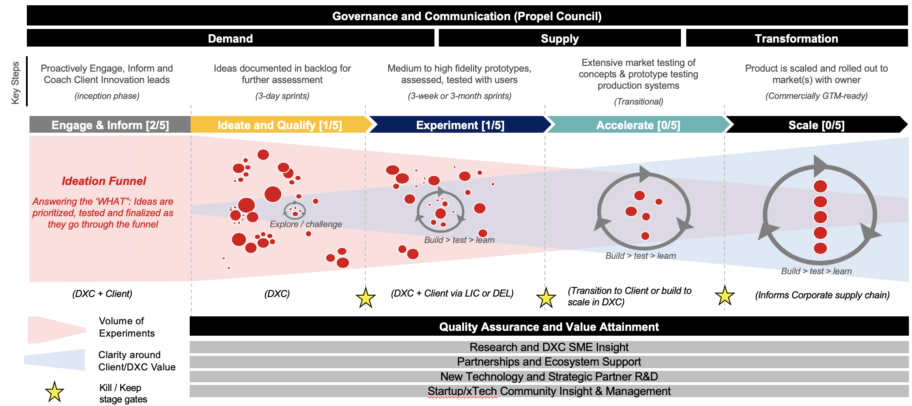

# Propel

## What is it?

Propel is an Innovation Programme which seeks to build progressive engagements with new technology partners and *Tech startups in order to develop a series of experiments or demonstrators that showcase to a Client/Sector/Regional known issue or opportunity.

Experiments can be proposed by anyone within the organisation having identified a known problem space upon which a technology provider or partner has been identified that has a potential solution. The key benefit to this approach is the reduced risk and expenditure to the client on an approach that might fail. Keeping a tight scope and short timescale (days not weeks or months and $1000's not $100,000's) means that lots of iterations and approaches can be validated and discarded or tried and built upon incrementally and considerably lowered risk/cost.

Discussions on the approach were held between the Account CTO and AGM to explain the operating model, governance, financial oversight and client impact and upon arriving at a satisfactory description of how the workstream would operate a sum of £250,000 was ring-fenced to facilitate the experiment pipeline.

The additional benefit to DXC is the opportunity to get infront of a client and talking about their challenges in a very different manner. 

## How does it work?

The Propel pipeline follows a recognisable "Innovation Funnel" approach.  We start with an ideation funnel which may be formed out of a number of constructs. It can be a set of strategic challenges or objectives set by Senior leadership on the Account team or within the Client themselves. These can then be communicated and socialised within the DXC communiity for potential solutions which are ultimately pitched to the 'Propel Council' for approval to proceed to experiment.
Alternately a pipeline of experiments can be maintained on the Account/Sector/Region that have some basic informatino about the experiment, it's approach and likelihood of impact to a client base etc [See the Pipeline tracker for greater detail] 

Next we move to Ideate & Qualify where a more detailed look at the experiment pipeline and it's likelty impact to the client and their issues. This series of experiments is reviewed on a regular basis by the Propel Council or nominees of that group for qualification to proceed to experiment.

Following approval to proceed the experiment is actually carried out and progress reported back to the Council. Experiments should quickly be spotted where they're unlikely to succeed which will allow for fast kill/keep decisions. Failure should not be avoided and decisions to stop should be captured and understood without fear of negative impact.

For those experiments that succeed in meeting their expected outcomes should next enter a phase of planning and design that quickly identifies the key value streams and opportunities for commercial impact to an Account/Industry or Region. This will rapidly provide visibility of the likely impact of investing in a further cycle of development and enabling value capture. The final phase is the enterprise hardening and 'readying for client contact' of any experimental solution and incorporation into the DXC offerings in order that it can be provided to the Clientbase and operated/deployed on their behalf.

## How we oversee the programme

The Propel Council is made up of the Account DGM, CTO, DSD and is minuted and formally governed in order to track decisions. 

That group sits bi-monthly to review the contents of the [Propel Tracker spreadsheet](https://teams.microsoft.com/l/file/D942BB85-EC40-4FB6-BE10-610B21C07434?tenantId=93f33571-550f-43cf-b09f-cd331338d086&fileType=xlsx&objectUrl=https%3A%2F%2Fdxcportal.sharepoint.com%2Fsites%2FDBOpportunitySpotting%2FShared%20Documents%2FGeneral%2FInnovation%20Pipeline%20Tracker_v4.xlsx&baseUrl=https%3A%2F%2Fdxcportal.sharepoint.com%2Fsites%2FDBOpportunitySpotting&serviceName=teams&threadId=19:a2d72cc91c924531b3571b1fb8a14c8c@thread.skype&groupId=818ffc7e-7f27-4026-9cca-956441af99f4) and to report back on status of experiments, next steps and a forum to raise blockers to progress. The finances for the experiments are tracked in the same artefact, forecasts are tracked bi-monthly with the Propel Council and reported back into the DB Account Finance team.

The Council works under the following Terms of Reference.

### Background	
- Propel is the title of the Deutsche Bank Account Innovation workstream and seeks to support the Client Digital Transformation agenda
- This terms of reference is to frame that workstream and provide context and formal governance to enable it

### Objectives
- The aim of Propel is to drive net new business opportunities through rapid prototyping, customer validation, commercial desirability and scaling to sales opportunit 
- Propel will build a pipeline of experimentation opportunities which will be overseen by the Propel Council 
- The Propel Council will disburse small amounts of its allocated budget on experiments it believes meets specific criteria to progress (desirability, doability, potential to scale, client propensity to spend, timeline to buy tbc) 
- It is expected that Propel will rapidly generate a series of technical demonstrators and prototypes that can be showcased with the Client on a regular cadence and their viability and commercial impact tracked and reported|

### Issues 
- Consolidated and transparent ideation and collaboration platform to gather and develop ideas and opportunities for the client and other industry sectors (spreadsheet, Sharepoint, Wazoku, Spark)
- Connecting development of hypotheses and ideas for experimentation to viable incentivization models that avoid driving negative behaviours (qualifying out, excessive specialization)
- Capacity to support and drive Propel pipeline, run and formally govern council triage meetings, build and elaborate ideas in partnership with submitters
- LIC/DTC capacity to support and develop demonstrators 
- Disruption of ongoing client innovation activity and links back into organisation

### Methodology
- Further, ongoing communication on why the Propel workstream is important and how it fits into the Client account
- Develop an MVP approach to ideation platform (select best/lightest of existing solutions)
- Build a pipeline of ideas and experiments to evaluate, validate and execute upon, triaged under formal governance by Propel Council
- Showcase with Client (and other sectors) and develop customer interaction/traction in order to move towards sales motion
- Close the loop back to respective offering family to ensure feedback mechanism

### Expertise
- LIC/DTC technical SME
- Propel workstream programme lead
- Account Innovation champion (SHB)

### Reporting
- Requests for new submissions for consideration
- Experiment pipeline and status of work inflight
- Completed pipeline and progress to scaling and Client/Sector leverage

### Work plan
- Provide a summary of the anticipated work
- Describe the activities and necessary resources required for achieving the experiment outcome and purpose
- Provide the activity schedule template
- Describe The finance resources allocated to the project
- For a more detailed woork plan, initiation checklist and tracking artefacts please see [this Jira](https://jira.csc.com/browse/CSS-286)

### Propel Council Membership
- Scott Brown (CTO)
- Gordon Hoff (AGM)
- David Oldham (ASL)
- David Rimmer (DGM)
- Lee Tobutt (CFO)

Bi-weekly meeting cadence to be confirmed based on demand. Can be instituted on an extraordinary basis but any request should be no more than 10 days from a formal sitting. Quorate with any 4 of the above attendees